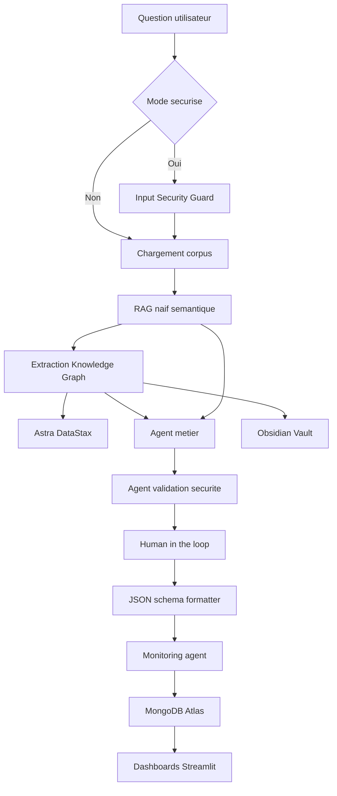

# Architecture

Le projet implemente un assistant agentique LangGraph pour la gestion d'incidents logistiques industriels.

## Vue Globale

## Composants

- `main.py`: interface CLI interactive.
- `graph.py`: orchestration LangGraph.
- `rag.py`: recherche semantique naive et synthese RAG.
- `knowledge_graph.py`: extraction d'entites, relations et persistance Astra.
- `secure_agents.py`: agent metier securise et validation de sortie.
- `vulnerable_agents.py`: agent volontairement vulnerable pour Red Team.
- `hitl.py`: validation humaine console ou externe.
- `monitoring.py`: metriques et enregistrement MongoDB Atlas.
- `dashboards/`: dashboards metier et monitoring.

## State LangGraph

Le state contient:

- question utilisateur;
- resultat de securite d'entree;
- documents corpus;
- resultats RAG;
- reponse RAG synthetique;
- entites et relations Knowledge Graph;
- statut Astra;
- plan d'action;
- decision HITL;
- validation securite;
- JSON final;
- monitoring.

## Donnees

- Corpus: `data/corpus/*.txt`
- JSON schema: `schemas/incident_response.schema.json`
- Knowledge Graph visuel: `obsidian-vault`
- Knowledge Graph persistant: Astra DataStax
- Monitoring: MongoDB Atlas

## Sortie

La sortie principale est un JSON valide contenant:

- `answer`;
- `incident_type`;
- `risk_level`;
- `evidence`;
- `knowledge_graph_evidence`;
- `action_plan`;
- `human_validation`;
- `database_status`;
- `security_validation`;
- `monitoring`.
